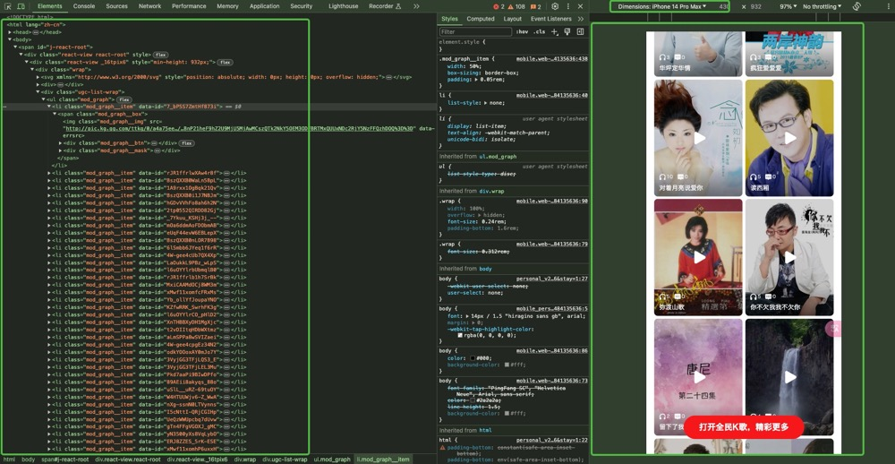

# 背景
用于下载全民K歌的歌曲，便于做信息备份

# 功能说明
1. 支持对指定用户公开的作品进行下载，包含m4a、mp4
2. 支持对每首歌的封面、相册、讨论信息等下载，部分是以文件、部分是以JSON存在的
3. 以上的内容是以独立的文件保存的，按需更换代码就行（如果未来没有来重构这部分代码的话）

# 使用说明
1. 获取用户全部的歌单
   2. 这个步骤，可以用Chrome开启手机模式，然后滚动全部歌曲之后
   3. 在Element里，copy整个页面到：
      - 之所以这么干，是因为不想再去调用K歌的API获取列表了
      - 也只有在移动版上，滚动之后才能获取到全部歌，见：[image](src/main/resources/images/02.获取全部的歌单方式，手机模式滚动页面，之后copy html 页面到文件.jpg)
      - 软件默认是不让下载的，付费好像能下载，但是不知道能不能导出
2. 解析html页面，获取网站的歌曲信息，输出到JSON文件
3. 对JSON文件进行逐条解析，下载每首歌到本地

---

🥰  enjoy it!